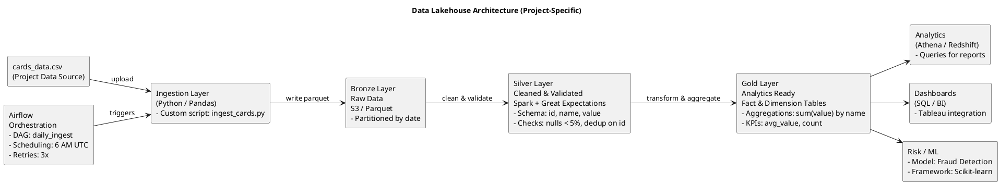

# Financial Transactions Data Platform with Real-Time Risk & Analytics Pipeline

A comprehensive platform for processing financial transactions, incorporating real-time risk assessment and analytics pipelines.

## Features

- Data ingestion from various sources
- Real-time streaming and processing
- Risk analytics and validation
- Orchestrated workflows for transaction handling

## Installation

1. Clone the repository:
   ```
   git clone https://github.com/yourusername/financial-transactions-platform.git
   ```
2. Navigate to the project directory:
   ```
   cd financial-transactions-platform
   ```
3. Install dependencies:
   ```
   pip install -r requirements.txt
   ```

## Usage

Provide examples of how to use the project. For example:

```python
from ingestion.ingest_to_s3 import Ingestor

# Example code
ingestor = Ingestor()
ingestor.ingest_data()
```

## Architecture Diagram

The project architecture is defined in PlantUML format. Below is the diagram code:



## Project Structure

- `architecture/`: Contains architecture diagrams (e.g., `architecture.puml`)
- `Data/`: Sample data files (e.g., `cards_data.csv`)
- `ingestion/`: Scripts for data ingestion (e.g., `ingest_to_s3.py`)
- `orchestraction/`: Orchestration logic
- `processing/`: Data processing modules
- `sql/`: SQL scripts
- `streaming/`: Streaming data handling
- `validation/`: Data validation components

## Contributing

1. Fork the repository.
2. Create a new branch (`git checkout -b feature-branch`).
3. Make your changes and commit them (`git commit -am 'Add new feature'`).
4. Push to the branch (`git push origin feature-branch`).
5. Create a Pull Request.

## License

This project is licensed under the MIT License - see the [LICENSE](LICENSE) file for details.

## Contact

Your Name - hemanthreddypolu@gmail.com

Project Link: [https://github.com/yourusername/financial-transactions-platform](https://github.com/yourusername/financial-transactions-platform)
